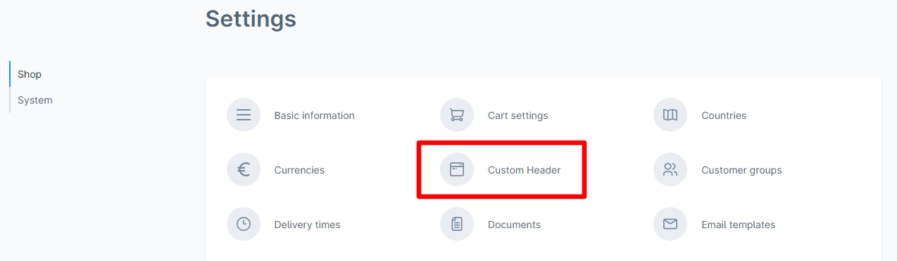
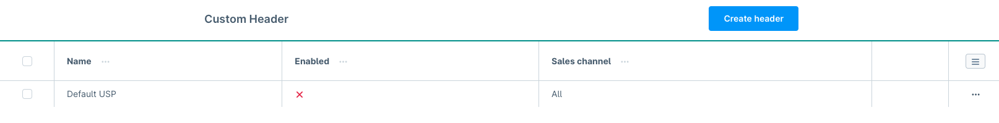
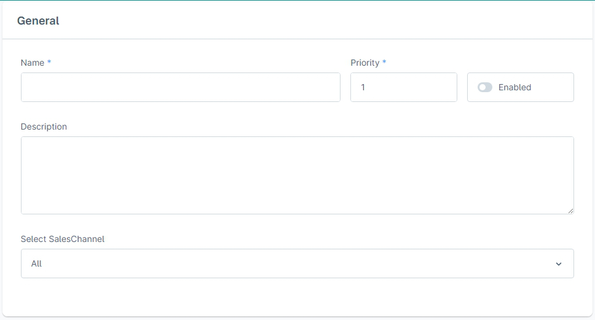
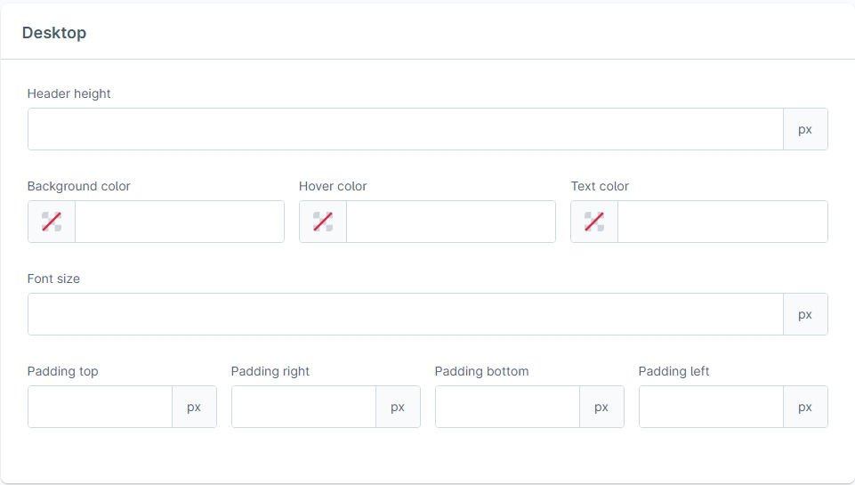
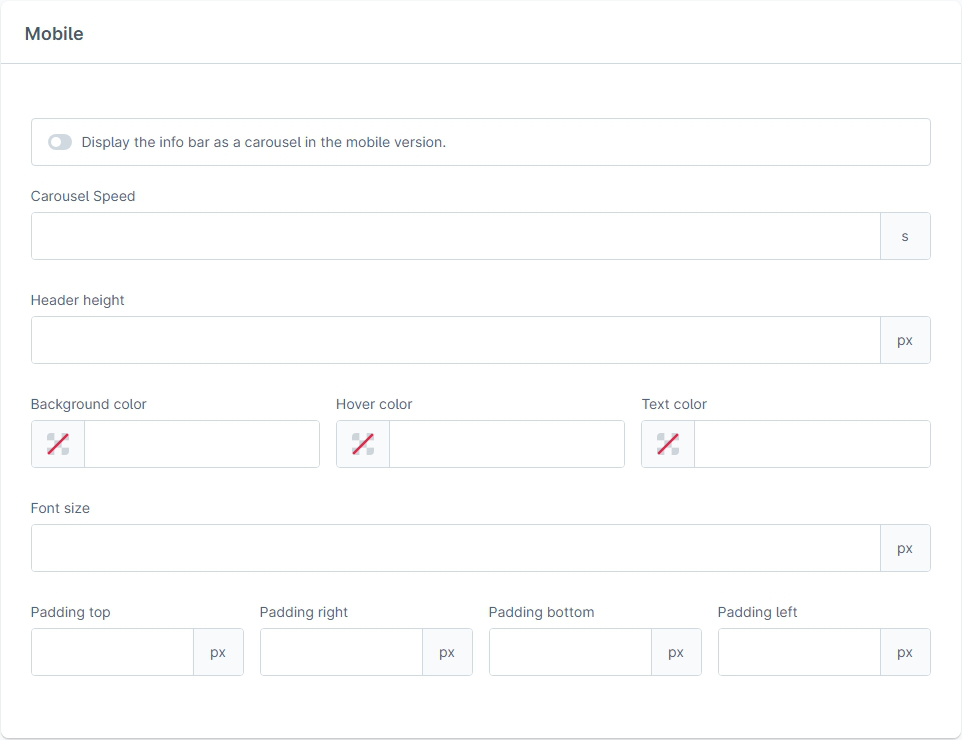
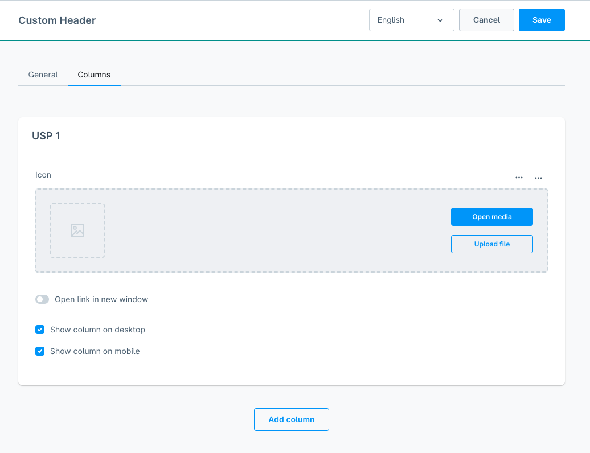

# Shopware 6 Custom Header

| Version | Changes                                                                                                               | Shopware Version |
|---------|-----------------------------------------------------------------------------------------------------------------------|------------------|
| 1.0.0   | First release                                                                                                         | <= 6.1           |                                             
| 1.1.0   | Support for Shopware 6.2                                                                                              | **<= 6.2**       |                                 
| 1.2.0   | Bugfix that can cause icons to not be shown Shopware 6.3 compatibility                                             | **<= 6.4**       |
| 1.3.0   | New option 'open in new tab' Bugfix: sales channel specific settings                                               | <= 6.4           |
| 1.4.0   | Added snippet key support to the text and the link of the USPs                                                        | <= 6.4           |
| 1.5.0   | Moved icon selection to top of the configuration                                                                      | <= 6.4           |
| 1.6.0   | Bugfix: Empty  element exists, when no icon is selected. Added a new css class.                              | <= 6.4           |
| 2.0.0   | Changed to Shopware v6.5                                                                                              | **6.5 & 6.6**    |
| 2.1.0   | New option: 'Display the info bar as a carousel in the mobile version.'                                               | 6.5 & 6.6        |
| 3.0.0   | Advanced Header Configuration: Multiple header configurations, any number of columns, improved language Support       | **6.6**          |
| 3.1.0   | Advanced header configuration: Multiple headers can be displayed simultaneously in the frontend according to priority | **6.6**          |
| 4.0.0   | Changed to Shopware v6.7                                                                                              | **6.7**          |
| 4.0.1   | Bugfix: create-button in admin-panel                                                                                  | **6.7**          |
| 4.1.0   | Advanced header configuration: Multiple headers can be displayed simultaneously in the frontend according to priority | **6.7**          |
| 4.1.1   | Accessibility Improvement Act (BFSG) conformity established                                                           | **6.7**          |

> [!Important]\
> Version 2.0.0 is no longer compatible with Shopware 6.4 or below!\
> Version 3.0.0 is no longer compatible with Shopware 6.5 or below!

# Installation

## Zip Installation package for the Shopware Plugin Manager

* Download the [latest plugin version](https://github.com/scope01-GmbH/ScopCustomHeader/releases/latest/) (
  e.g. `ScopCustomHeader-1.5.0.zip`)
* Upload and install plugin using Plugin Manager

## Git Version

* Checkout Plugin in `/custom/plugins/ScopCustomHeader`
* Install the Plugin with the Plugin Manager

# Configuration

> [!NOTE]
> The configuration has changed fundamentally in Version v3.0.0. Information about the configuration in older versions can be found in the Readme.md of the corresponding [version](https://github.com/scope01-GmbH/ScopCustomHeader/tags), e.g. [here](https://github.com/scope01-GmbH/ScopCustomHeader/blob/v2.1.0/Readme.md) for v2.1.0.

## Access the configuration
To access the header configuration, navigate to the settings within the Shopware administration. There, you can open the custom header configuration as shown below:

## The custom header list
The header configuration consists of a list of all existing header configurations. By default, it contains a "Default USP" configuration. In case you updated the plugin from an older version, this "Default USP" contains your previous configuration. In case you had different configurations for different Sales Channels, a "Default USP"s will be created for each Sales Channel.
In this list you can select a header to edit, remove a header or create a new header.

## Creating/Editing a header
In the "General" section, you can enable or disable the custom header, set an internal name and optionally an internal description, and set the priority of the custom header. Only the header with the highest priority will be displayed.

In the "Desktop" section, you can customize the header's style for desktop devices.

In the "Mobile" section, you can customize the header's style for mobile devices. Empty values will use the values from the desktop configuration.

### USP columns
In this section, you can manage the columns that should be displayed in the header. Each column can consist of a name (the text that will be displayed in the frontend), a link and an icon. Each column must either contain a name or an icon. 

The name, link and icon of a column can be maintained in multiple languages using the language-switch in the top bar (next to the save/cancel buttons).

Additionally, you can choose to show or hide the column on desktop or mobile devices, and if the link should be opened in a new tab. Hiding all columns on mobil/desktop will result in the complete header to not been shown on the corresponding device.

You can create as many columns as you want for your header, using the button at the bottom. Use the context menu on the right side of a column card to either delete the column or change its position by moving it up/down.
